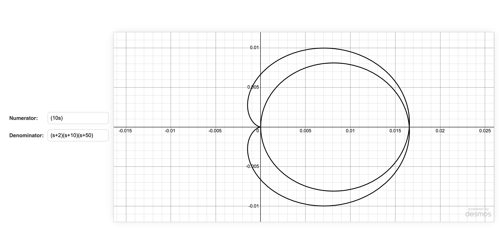

# Nyquist Plot
## Overview
This web application allows users to input transfer functions and visualize the Nyquist plot using the Desmos API.

## Usage
1. The website is deployed here: [Nyquist Plot](https://yk9221.github.io/Nyquist-Plot/)
2. Input the numerator and denominator of the transfer function
3. Press Enter to draw
4. This will output the Nyquist plot

## Example

This is an example of the Nyquist plot:

$$
\
\frac{10s}{(s + 2)(s + 10)(s + 50)}
\
$$

The input would thus be
- Numerator: (10s)
- Denominator: (s+2)(s+10)(s+50)
